[](https://iaceene.github.io/42_Subjects/?subject=NetPractice) -- [](https://iaceene.github.io/Net_Practice_42)

---

## 📌 **Table of Contents**  
1. [OSI Model](#-osi-model)  
2. [TCP/IP PROTOCOL SUITE](#-tcp-ip-protocol-suite)  
3. [IP Addresses & Subnet Masks](#-ip-addresses--subnet-masks)  
4. [Network Devices](#-network-devices-explained)  
5. [How Data Travels](#-how-data-travels-across-networks)  

---

## 🧩 **OSI Model**  


The OSI (Open Systems Interconnection) model is a conceptual framework that standardizes the functions of a telecommunication or networking system, dividing it into seven layers. This model helps in understanding how different network components interact to enable communication between devices, regardless of their underlying technology. created by ISO (International Organization for Standardization), think about layers like a steps to communicat between devices.
This steps or layers is 7, and this steps happend is the two devices, the sender and the reciever do this steps in reverce,
if the sender goes from 7 to 1, reciever goes from 1 to 7.

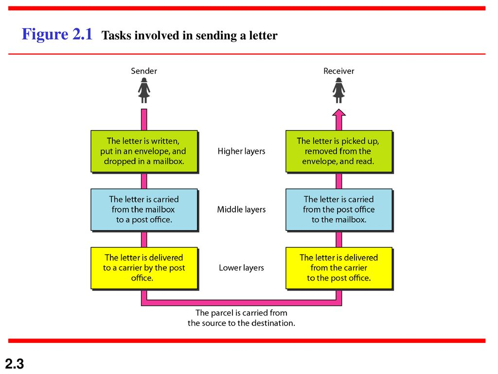

this is how the data transform in each layer :

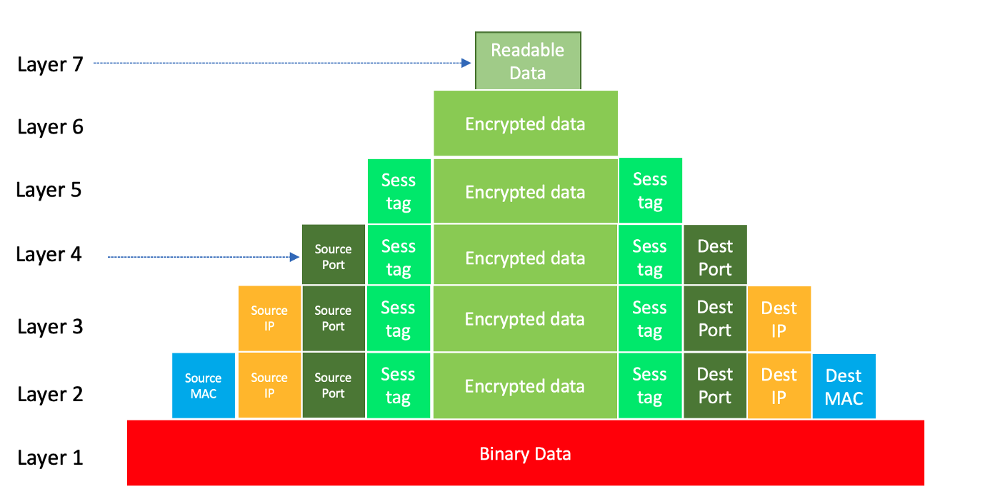
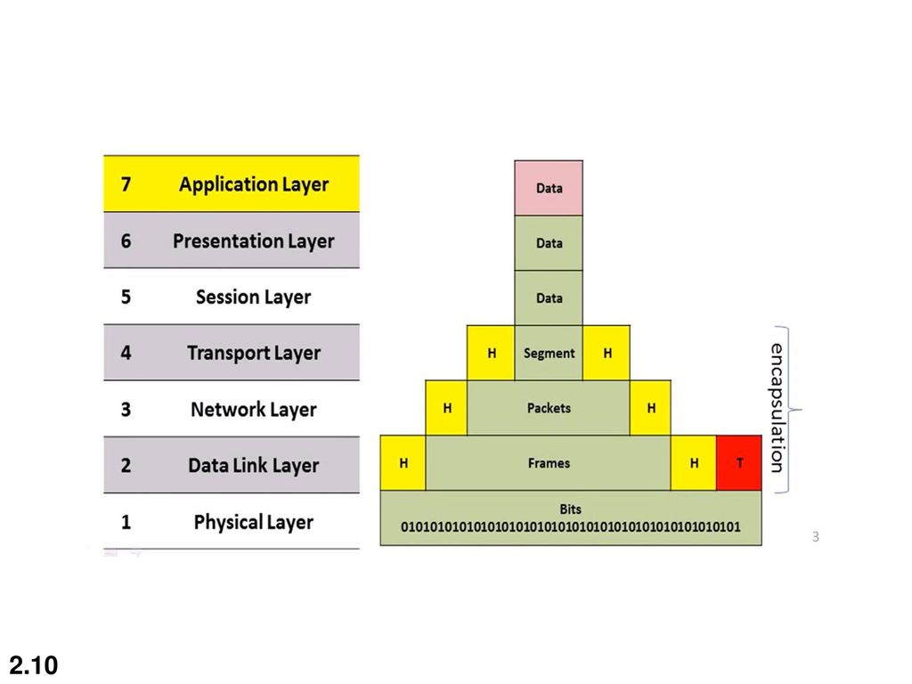
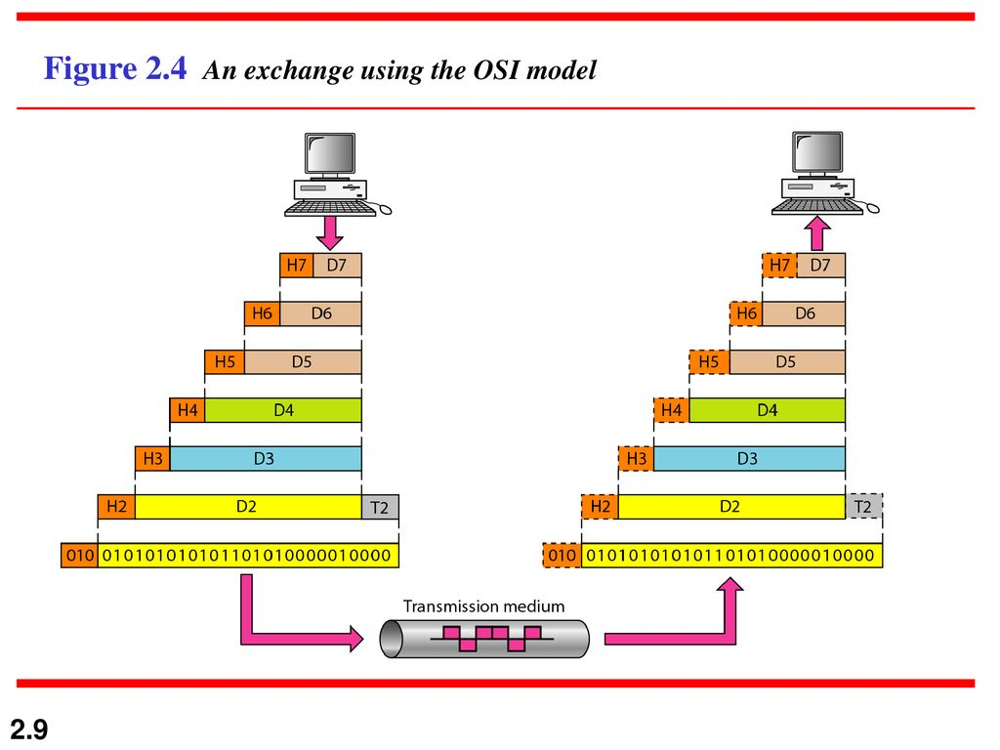


##### At sender:
⚫at each layer, a header can added to the data unit.
•At layer 2 a trailer is added as well.
•When formatted data unit passes through physical layer it is changed into an electromagnetic signal and transported along physical link.
##### Encapsulation:
A packet (header and data) at level 5 is encapsulated in a packet in level 4, and so on.
The data portion of packet at level N-1 carries the whole packet (data and header/trailer) from level N.
##### At destination:
⚫A data then move back up through the layer
⚫a headers and trailers attached to data at the corresponding layer are removed (decapsulated) and action appropriate to that layer are taken. (unwrapped/decapsulated)
At layer 5 the message is again in form appropriate to the application and is made available to user.

---
### OSI Layers
##### 1. Physical layer

The physical layer is responsible for movements of individual bits from one hop (node) to the next.

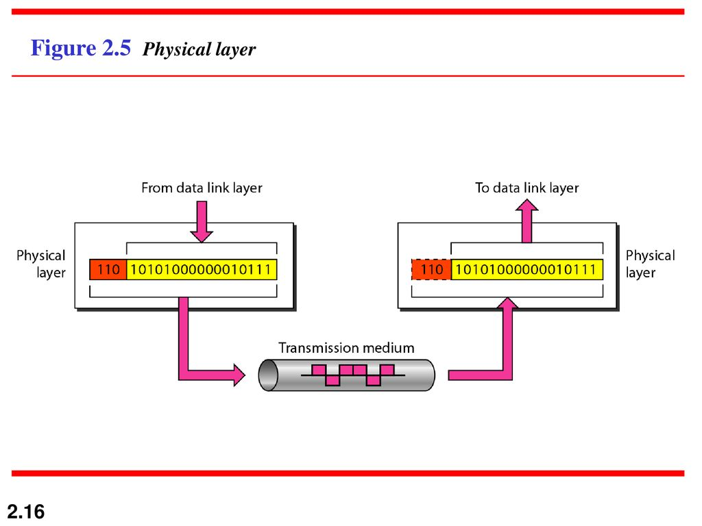


##### Physical characteristic of interfaces and media:
It defines the characteristic of the interface between devices and media. It also define the type of transmission media
##### Representation of bits:
The bit stream must be encoded into signals. It defines the type of representation ( how 0, 1 are changed to signal).
##### Data rate:
It defines the number of bits sent per second and also the duration of bits.
##### Synchronization of bits
The sender and receiver must be use the same bit rate also the receiver clock must be synchronized

##### Line configuration
Physical layer is concerned with the connection of devices to the media (point-to point or multipoint)
##### Physical topology:
• How devices connected to make a network
Devices can connected by using Star, mesh, bus, ring or hybrid topology
##### Transmission mode:
• It defines the direction of transmission between two devices (simplex, half-duplex, or full duplex)

#### 2. Data Link Layer(hop to hop delivery)

The data link layer is responsible for moving frames from one hop (node) to the next.

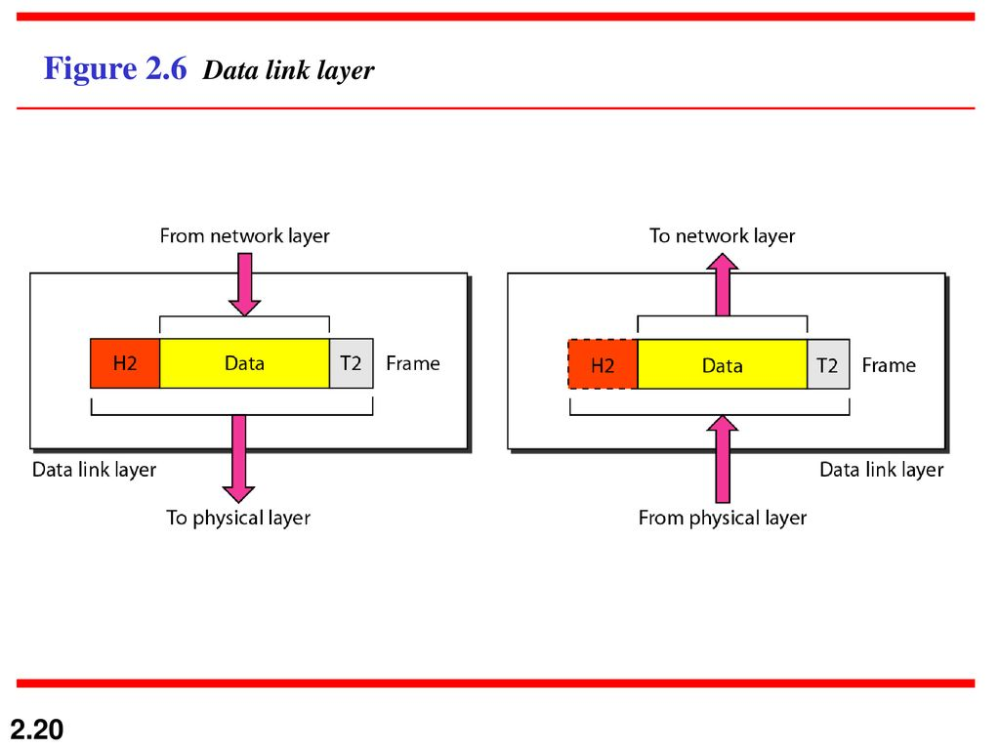


##### Framing:
Divide the stream of bits received from network layer into data units called frames
##### Physical addressing:
• It adds a header to the frame to define the sender and receiver of the frame.
If the frame for a system outside the sender's network the receiver address: is the address of the connecting device that connects the network to next one (Router/switch).
##### Flow control:
It imposes a flow control mechanism, if the data rate at the receiver is less than produced by sender the data link layer imposes a flow control to avoid overwhelming the receiver

##### Error control:
• Add mechanisms to detect and retransmit damaged or lost frames.
• Prevent also duplication of frames.
• Error control is normally achieved through a trailer added to the end of frame.
##### Access control:
• When two or more devices than one devices are connected to the same link, data link layer protocols are necessary to
determine which device has control over the link at given time.

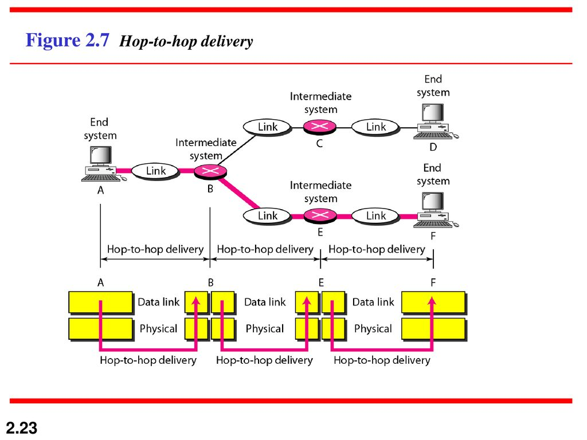


Known also as the MAC or link address

Is the address of a node as defined by its LAN or WAN
It is included in the frame used by data link layer (Header) Ethernet uses 6-bytes (48-bits) physical address that imprinted on the NIC

Example :
A node with physical address 10 sends a frame to a node with physical address 87. The two nodes are connected by a link. At the data link level this frame contains physical addresses in the header. These are the only addresses needed. The rest of the header contains other information needed at this level. The trailer usually contains extra bits needed for error detection

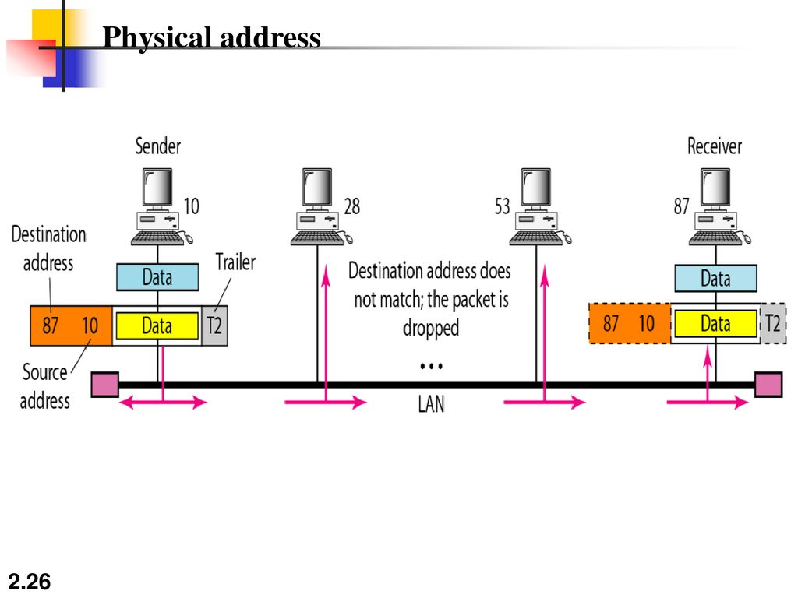

#### 3. Network Layer(hop to hop delivery)

- The network layer is responsible for the delivery of individual packets from the source host to the destination host across multiple network.
- If two system are connected to the same link (network), no need for this layer.

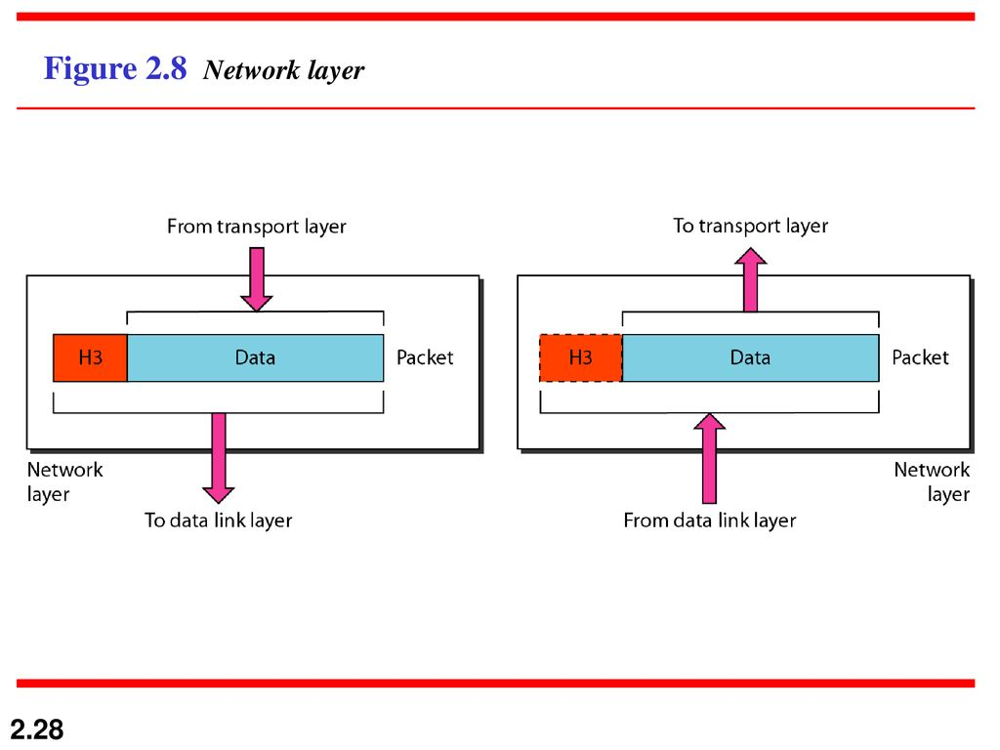

##### Logical addressing
• In contrast to physical addressing implemented by data link layer
handling the addressing problem locally. Net work layer adds unique identifier (IP or logical address) to the packet.
These unique identifier( as tel. no, each tel. has unique number) enable special devices called router to make sure the packet get to correct system.
##### Routing:
provide the routing mechanism for the router which route the packet to their final destination.
Routers: devices used when independent networks are connected to create an internetworking (network of networks)

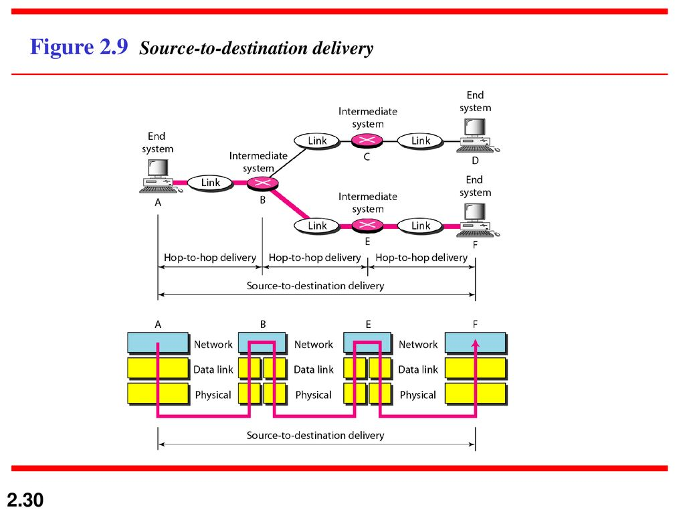


- IP addresses are necessary for universal communications that are
independent of physical network.
- No two host address on the internet can have the same IP address
- IP addresses 32-bit address that uniquley define a host connected to the Internet
 
Logical address (IP) The physical addresses will change from hop to hop, but the logical addresses remain the same. 


- The following figure shows a part of an internet with two routers connecting three LANs. Each device (computer or router) has a pair of addresses (logical and physical) for each connection. In this case, each computer is connected to only one link and therefore has only one pair of addresses. Each router, however, is connected to three networks (only two are shown in the figure). So each router has three pairs of addresses, one for each connection.

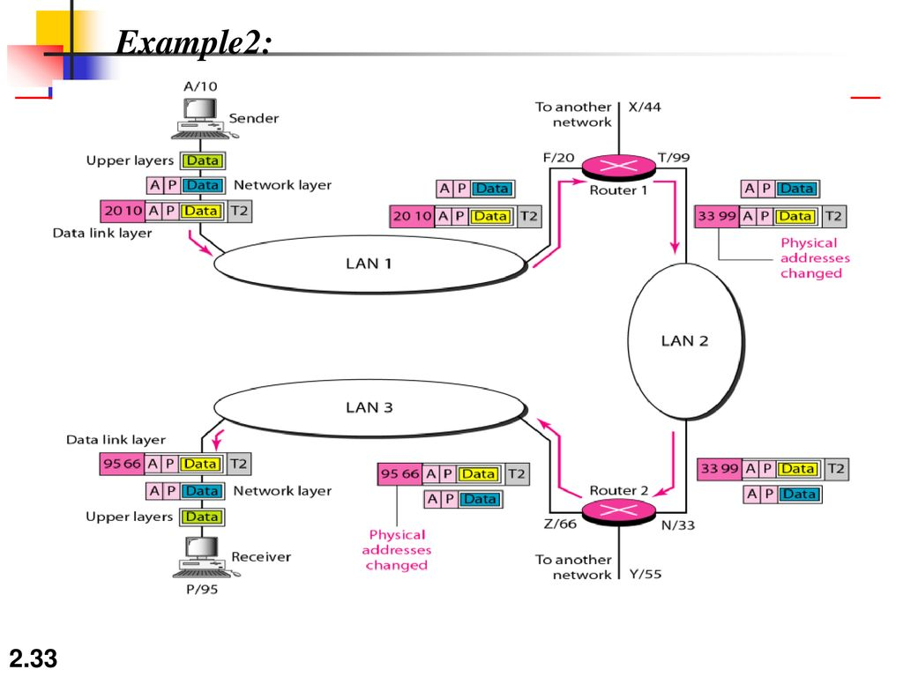

##### 5. Session Layer

The session layer is responsible for dialog control and synchronization.


1. Dialog control:
Allows two systems to enter into dialog. It allows communication between two processes in either half or full duplex.
2. Synchronization (Recovery)
Allow a process to add check points (Synchronization point) into a stream of data. So that if a failure of some sort occurs between checkpoints, the layer can retransmit all data since the last checkpoint.

##### 6. Presentation Layer

The presentation layer is responsible for translation, compression, and encryption.

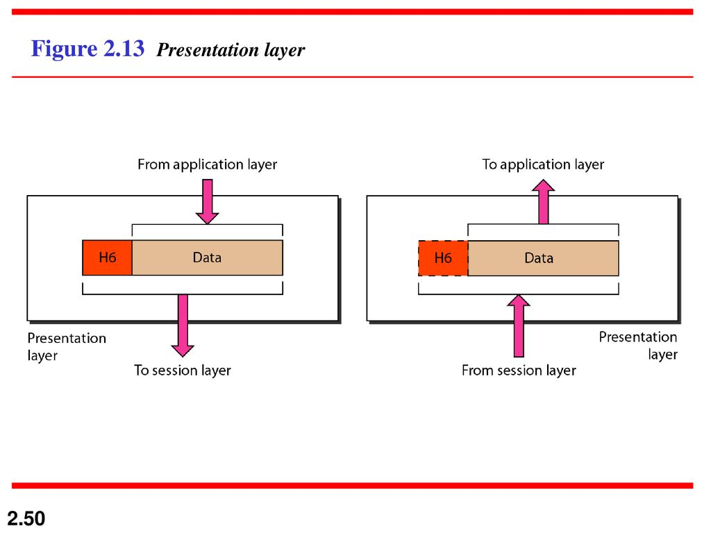

- 1. Translation
At the sender it changes the information from its sender –
dependent format into common format. At receiving, changes the common format into its receiver-dependent format
- 2. Encryption-Decryption
To ensure privacy and security
- 3. Compression
Data compression reduces the number of bits contained in the information. It is important in the transmission of multimedia such as audio or video

##### 7. Application Layer

The application layer is responsible for providing services to the user.

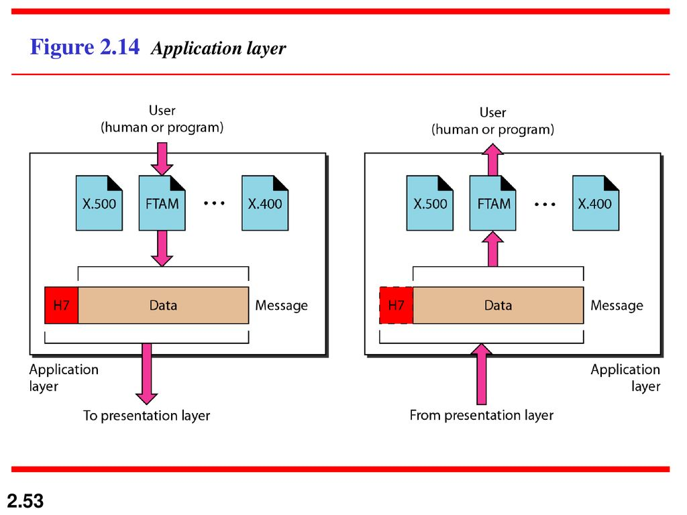


The application layer is responsible for providing services to the user such as
Mail services
File transfer and access
Remote log-in Accessing the web (WWW)
- Telnet: A service that enables users on the internet to log onto remote systems from their own host system.
- HTTP: Hyper text transfer protocol used for network file transfers in WWW environment
- SMTP: Simple mail transfer protocol used to send electronic mail on the internet.

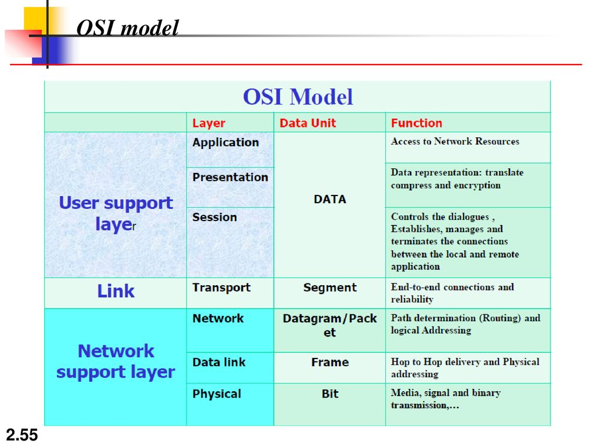

---


## **TCP/IP PROTOCOL SUITE**

The layers in the TCP/IP protocol suite do not exactly match those in the OSI model. However, when TCP/IP is compared to OSI, we can say that the TCP/IP protocol suite is made of five layers: physical, data link, network, transport, and application.
Topics discussed in this section:
Physical and Data Link Layers
Network Layer
Transport Layer Application Layer

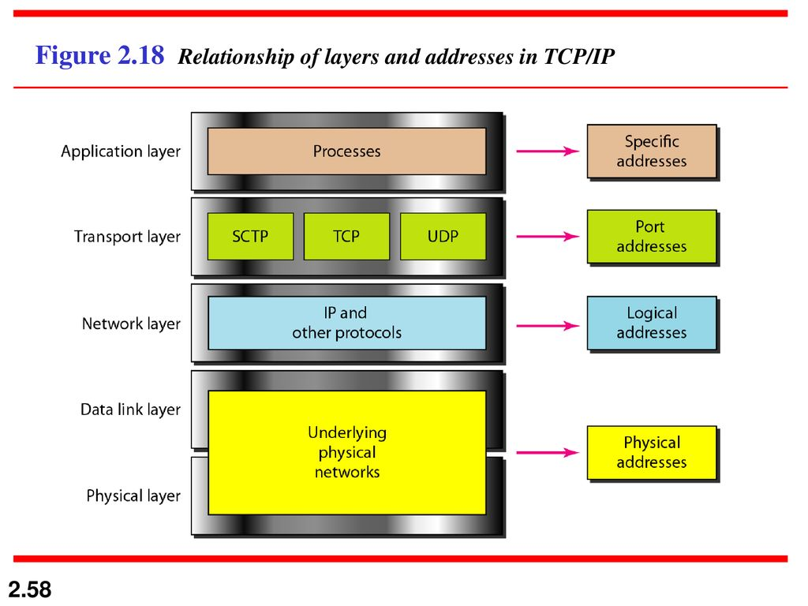

Most local-area networks use a 48-bit (6-byte) physical address written as 12 hexadecimal digits; every byte (2 hexadecimal digits) is separated by a colon, as shown below:
```
07:01:02:01:2C:4B
```
A 6-byte (12 hexadecimal digits) physical address.

---

## **IP Addresses & Subnet Masks**

Let us first look at my working definition of computer networks:

- Computer networks can be defined as the exchange of network packets between computing machines across the world with the help of data lines like wire cables, optical fibers, etc.

The Internet is a kind of computer network. Sorta.

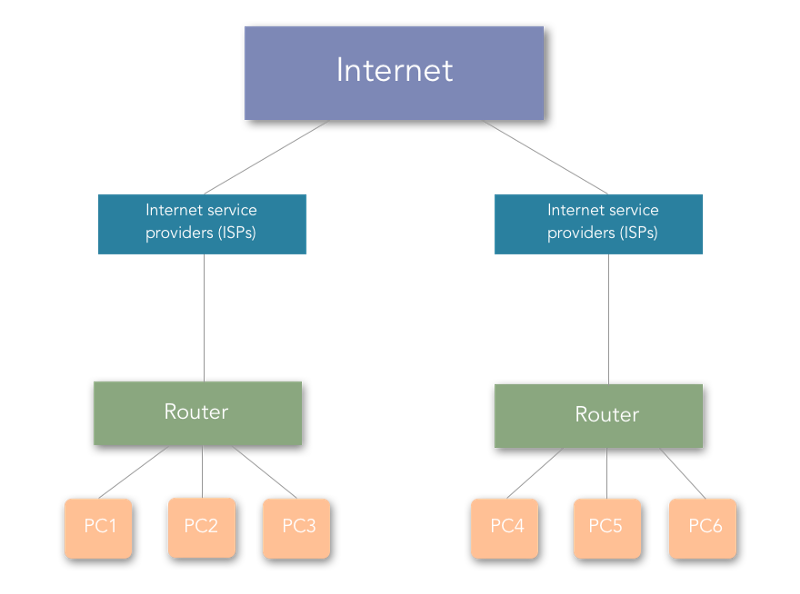

We will take a look at some commonly used terms and components and how they function in a computer network, some of which are in the above diagram.

##### Commonly used terms in Computer Networks
###### Nodes
Nodes in computer networks mean any computing device such as computers, mobile phones, tablets, etc which try to send and receive network packets across the network to another similar device.

###### Network Packets
Network packets are nothing but the information or units of data that a source node wants to send/receive to/from the destination node. In this article, network packets/data packets all convey the same meaning.

###### Internet Protocol (IPs)
Consider you want to send a birthday gift to your friend on their birthday, where will you send it? To their street address right?

Same is the case here. The early computer scientists wanted to identify computers on the internet with a unique number, something like a telephone numbers today. So, they came up with the concept of TCP/IP.

An IP of a computer device is the address of that device in a computer network. Technically, it is a 32-bit number used which identifies devices in a network. All the communication to and fro from the device in that network will be done in terms of its IP address.

Consider that you are uploading a file to any site or say to Google drive.

Talking at the lowest level of network communication, your file is converted to packets and each packet has the destination node address with it which is nothing but the IP address.

- IPv4: IPv4 addresses are 32 bits (four bytes) as explained in the definition. An example of the IPv4 address would be 104.244.42.129 which is the IPv4 address of twitter.com. They are stable to use and hence are used today to identify machines in the world.
- IPv6: IPv6 addresses are pretty new to the world and are basically eight hexadecimal numbers separated by “:”. An example of IPv6 address would be 2001:0cb8:85a3:0000:0000:8a2e:0370:7334. They are unstable and hence not used widely yet. The web is still using IPv4 due to its stability and there is no estimate when we will start to use IPv6 since it is not stable for now.
- IPv4 is classified into five classes named Class A, B, C, D, E.

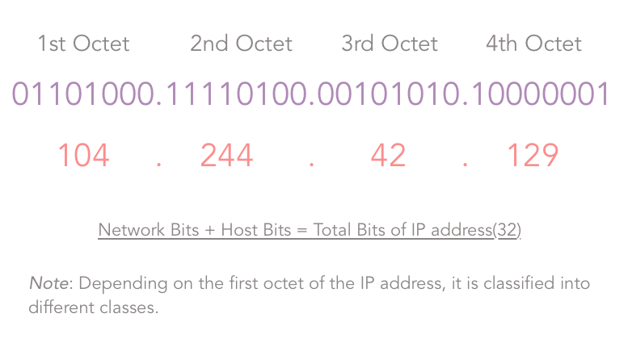

Octets in IP address.

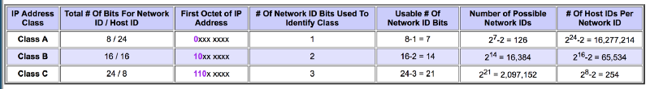

##### Class A: As shown in the third column of the above image, for a Class A IP addresses, the first bit of the first octet of the IP address is constant and is “0”.

The Second column indicates the Network bits and the host bits of the corresponding class of IP address. Consider in case of a Class A IP address, we have the following formula:

Number of networks/subnets = 2^(# of network bits) .

Number of valid hosts in each subnet = 2^(# of host bits) — 2 .

The number of network bits and host bits are decided by the default subnet mask of the class of IP address.

The default subnet mask for a class A IP addresses is 255.0.0.0, that is **11111111.00000000.0000000.00000000**. Thus, for class A:

Network bits = 8, and Host bits = 24.

Since Network bits = 8, Host bits = 24, their sum has to be 32, since IPv4 addresses are of 32 bits. But, since we are using the one bit (first bit in the first octet) to identify the class:

Number of usable network bits = Number of network bits — Number of constant bits = 8–1 = 7

Thus, the Number of possible networks in Class A = 2^7 — 2 = 126 and,

Number of possible hosts (that is devices that can be connected to the network) per network in Class A = 2^24-2 = 16277214 .

Now, here, for class A, you may wonder why I subtracted an extra 2 from the number of possible networks. It is because, for class A, 127.x.y.z was kept reserved. For other classes, the usual formula is used.

Thus, IP addresses in class A range from 1.x.x.x to 126.x.x.x.

##### Class B: the case is similar with Class B. The only difference is 2 bits of the first octet are constant (10) and they identify the class of IP address that is class B. All other calculations are same, and I am not mentioning them here since they are easy to grab from the table above. They range from 128.0.x.x to 191.255.x.x .

##### Class C: 3 bits of the first octet are constant (110) and they identify the class as class C. They range from 192.0.0.x to 223.255.255.x .

##### Class D and Class E: Class D and Class E are used for experimental purposes.

IPv4 addresses are mainly of two types:

- Static: These IP addresses are the ones which remain constant for a device over time. Examples of these are the remote servers that we use to host our apps, websites, etc. where we use the ssh client to ssh to our server.
- Dynamic: Generally, these are the IP addresses that a common computer in an Internet network is assigned. Try switching your router off and you will see a change in the IP address of your computer! (But only after reading this article ?). Now, you may be thinking who allocates these IP addresses? It is the DHCP (Dynamic Host Configuration Protocol) server which is explained briefly further in this article.
- Note: A device can have multiple IP addresses at the same time. Consider a device connected to two networks, wifi as well as any LAN network — it will have two IP addresses. This implies that the IP addresses are assigned to the interfaces and not directly to the computer.


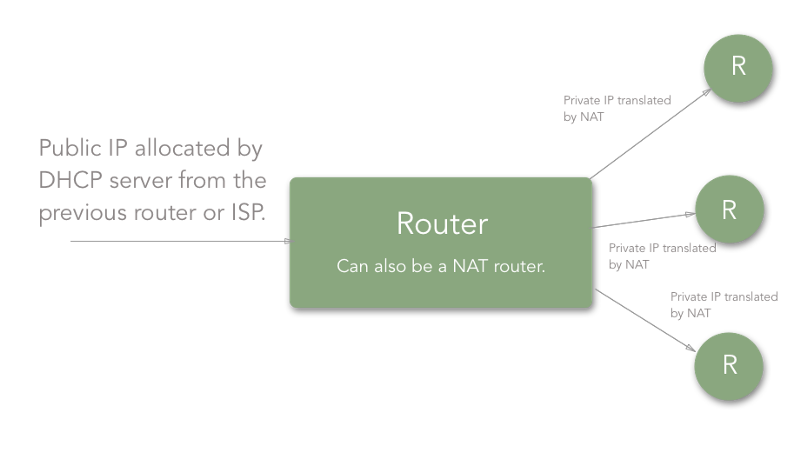


#### A Router.

Technically, a routing table is just a table with the list of “routes” from one router to other. Each route consists of the address of the other routers/nodes in the network and how to reach them.

```
Routing table:

Destination  Gateway     Genmask        Flags Metric Refs Iface
default      192.168.0.1 0.0.0.0        UG    1024   233  eth0
192.168.0.0  *           255.255.255.0  UC    0      0    wlan0
192.168.0.0  *           255.255.255.0  UH    0      2    eth0
```

- Above is an example of a routing table. The key points to take a note of here are:

- Destination: This is the IP address of the destination node. It indicates where the network data packet should end up.
- Gateway: Gateway is the component which connects two networks. Consider that you have a router connected to another router. Each of the routers has devices connected to it. So, the address of the last router (say R1 here) after which the network packet enters the other network (say R2’s network) is called the gateway. Usually, the gateways are nothing but the routers. Let me give one more example: say that your room is one network and your sibling’s room next to yours is another network, then the “door” between the two rooms can be considered the gateway. People sometimes refer to the “routers” as the gateway, because, that’s what they are, “a gateway to another network”.
- Genmask/Subnet mask: It is nothing but the net/subnet mask. A subnet mask is a number which when combined with an IP address allows you to divide the IP space into smaller and smaller chunks for use in both physical and logical networks. The explanation of how subnet mask calculations happen is beyond the scope of this article.
- Flags: Different flags have a different meaning. For example, in the first route, “U” in “UG” means the route is UP, whereas “G” in “UG” means GATEWAY. Since the route signifies a GATEWAY, it is a door to the other network. Whenever we send any data through this route, it gets sent to another network.
- Iface (Network interface): Network interface refers to the network that the route defined in the routing table is having the destination computer in. That is if you are connected to Wifi, then it would be “wlan” and when you are connected to a LAN, then it would be “eth”.

So this is the way a router works, with the help of Routing Protocol and Routing Table.

### Network Address Translation (NAT)
Network address translation is a technique used by routers to provide internet service to more devices with less usage of public IPs. Thus, a router is assigned a single IP address by the ISP and it assigns the private IPs to all the devices connected to it. NAT helps the ISPs provide internet access to more consumers.

Thus, if you are connected to the router of your house, your public IP will be visible to the world, but the private one will not. Whatever network packets are communicated will be addressed by your public IP (that is the public IP assigned to the router).


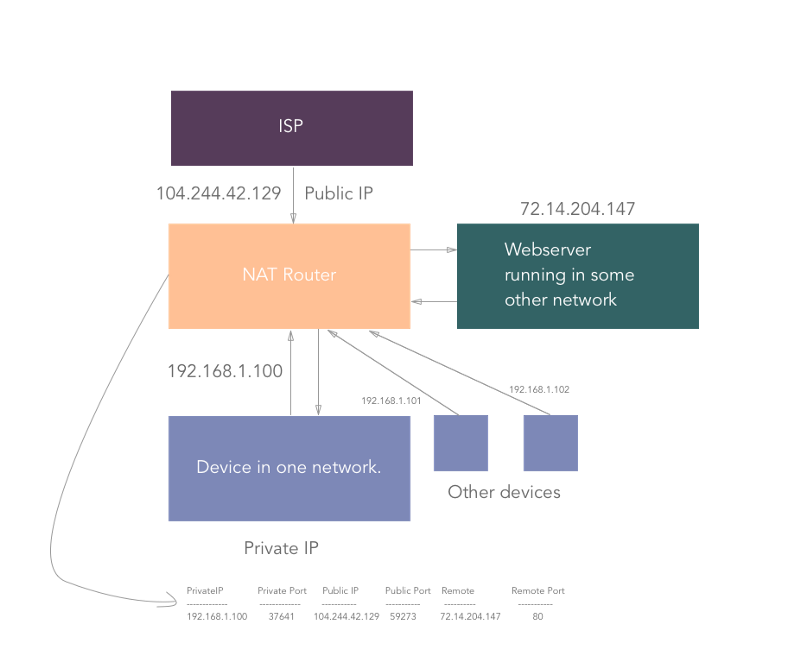

Consider the above figure. Let’s say that in your home network, you are trying to access medium.com (remote static IP: 72.14.204.147), from your computer (private IP: 192.168.1.100).

So, for your computer, the connection looks like:

```bash
192.168.1.100:37641 → 72.14.204.147:80
```

“37641” is the random port number assigned by NAT router to your device/computer. (When there is network communication between daemons running on different ports on a computer, the respective port is used by NAT). Each outbound connection gets an assigned port by the NAT router.

The connection is established in NAT like:

```bash
Private IP   |PrivatePort |PublicIP |PublicPort |Remote |RemotePort
------------- ------------ --------- ----------- ------- -----------
192.168.1.100 | 37641 | 104.244.42.129 | 59273 | 72.14.204.147 | 80
```

But, since the outside world of the network doesn’t know about your private address, the connection looks like the following to medium.com:
```bash
104.244.42.129:59273 → 72.14.204.147:80 
```
That way, we achieve assigning a higher number of IP addresses without wasting many public IPs.

Now, when medium.com sends the response back to 104.244.42.129:59273 , it travels all the way to your home router which then looks up for the respective private IP and private port and redirects the packet to your device/computer.

Note: NAT is a generalized concept. NAT can be achieved as 1:1, 1:N where 1, N are the number of IP addresses in the network. A technique called as “IP Masquerading” is a 1:N NAT.

### Dynamic Host Configuration Protocol (DHCP)
Dynamic Host Configuration Protocol or DHCP is responsible for assigning dynamic IP addresses to the hosts. The DHCP server is maintained by the ISP or previous router if there is a chain of routers to reach the host.

Thus, allocation of IP addresses is carried out by the DHCP server. Generally, ISP maintains a DHCP server and the routers in our houses get assigned a public IP from the DHCP server.

Note: Whenever a router or say a DHCP server maintained by an ISP or router restarts, the IP address allocation starts again and devices are allocated IPs which are different than the previous ones.

### Domain Name System/Server
We have already discussed that any machine is identified by the IP address.

Okay, so you are running a web server on your localhost on your machine. If you have dug around in the hosts on any Linux machine, you would have encountered something like this:
```bash
127.0.0.1        localhost
255.255.255.255  broadcasthost
::1              localhost
which means that even if you type 127.0.0.1 in your browser’s URL bar, it would mean the same as localhost .
```

Similar to the above, the websites you use daily are web servers running on some remote instance/node having a static IP address. So, typing that IP address in your browser’s URL bar will take you to the website?

Yes, surely it will. But, are you a superhuman to remember the IP addresses of thousands of sites?

- A Domain Name Server is a server having huge records of domain name mapping IP addresses which searches for the domain input and returns the respective IP address of the machine on which the website you want to access is hosted.

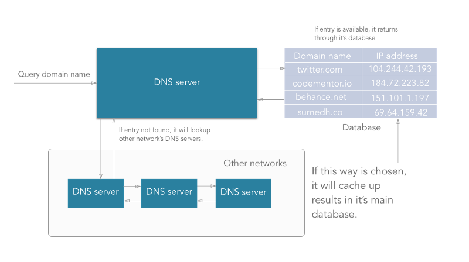

##### How does DNS work actually?

- DNS is managed by your ISP (internet service provider).
- When we type an URL in the address bar, the data packets travel through your router, maybe multiple routers to your ISP where your DNS server is present.
- DNS server present at the ISP looks up for the domain in its database. If an entry is found, then it returns it.
- If any entry is not found in its primary database that it maintains, the DNS server will travel through the internet to another DNS server maintained by another ISP and check if the entry is available in that another DNS server’s database. Along with returning the IP address taken from another DNS, it will update the primary database with this new entry also.
- Thus, sometimes (very rarely) a DNS server may have to traverse to multiple DNS servers to get a matching entry.
- If after traversing a lot of DNS servers across the internet, it doesn’t get a matching entry, then the DNS server throws an error indicating that the “domain name is invalid or doesn’t exist”.


The Internet Corporation for Assigned Names and Numbers (ICANN) is a consortium (a non-profit corporation) that manages the assignment of domain names and IP address ranges on behalf of the community.

A domain is divided into three parts as shown in the following figure.

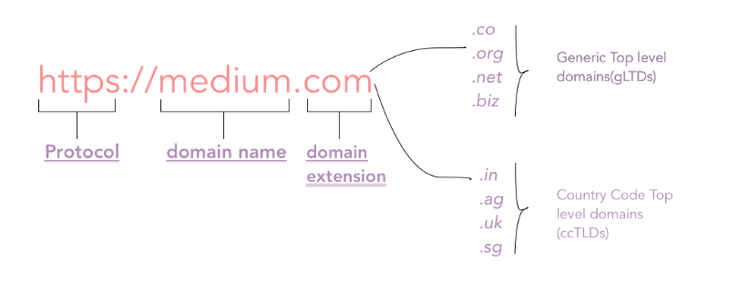

- Protocol: The protocol used to access the website, for example, HTTP, HTTPS, etc.
- Domain name: The main domain name in our domain. This can be anything that is available as per the ICANN registry.
- Domain extension: This is one which is considered important while buying a domain. Generally, it is classified into two types:

- Generic Top-level Domains (gTLDs): This includes most popular domain extensions like .com, .org, .net, .edu, .co, etc.

- Country Code Top-level Domains(ccTLDs): These indicate that the domain is related to the country code specified in the domain extension. For example, “.in” indicates that the website is originated from India. Also, some of the ccTLDs require that the person purchasing the domain should be from the same country. Most of the small country code extensions are not searchable from outside that country.

##### Internet Service Providers (ISPs)
Internet Service Providers are the companies that provide everyone Internet. The article you are reading now is because of the internet that your ISP provides you.

ISPs provide internet, handle routing your requests to the correct destination, resolve domain names with the help of DNS cache that they maintain, and handle all this network infrastructure which enables us to use the internet.

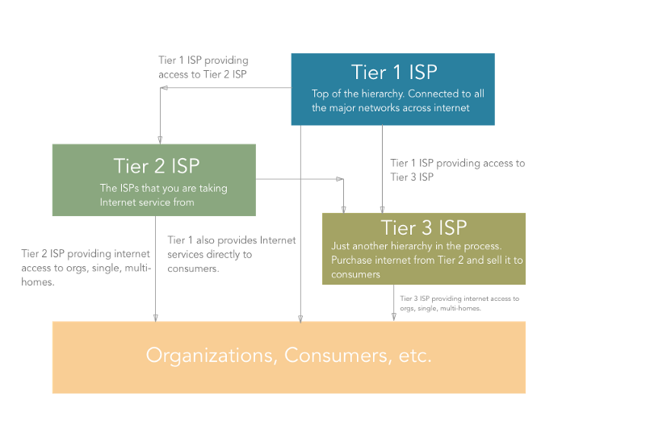

ISP is a hierarchical thing working across the internet. There are certain types of ISPs namely Tier 1, Tier 2, Tier 3 ISPs.

- Tier 1 ISPs are the ones which connect major networks on the internet. Consider them as the major highways of the internet. They are connected to almost every network on the internet. Also, they provide internet access to the Tier 2 ISPs. ex. CERFNet, UUNet, PSINet. They are also called Network Service Providers. These ISPs are connected to each other by means of large cables going beneath the sea.
- The Tier 2 (Regional) ISPs are the ones who primarily provide Internet services to organizations, consumers (that is “us”) or the Tier 3 ISPs. The internet connection you are using is from a Tier 2 ISP. However, organizations can also get Internet access from Tier 1 ISPs.
- Tier 3 (Local) ISPs are just like Tier 2. It’s just one more level of hierarchy out there that purchases bandwidth from Tier 2 ISP and sells it to consumers.
The traffic that goes through your router also goes through Tier 3 (if present), Tier 2, and ultimately through Tier 1 ISPs all the way to another network.

Woot Woot! I am happy that you are still with me. We will put all the things together now.

Putting all of the above things together
Up until now, we have learned about all the components needed to make everything work. Now, we will glue them together.

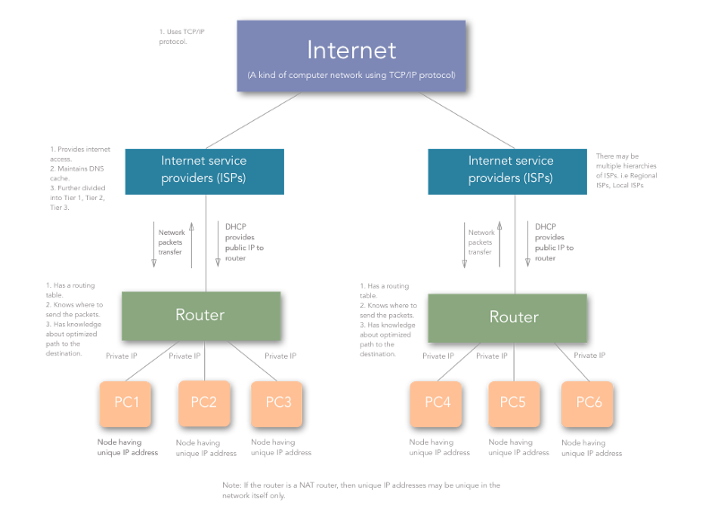

Let’s summarize all the things we’ve learned:

- When a computer/device comes online, it gets a private IP assigned by the router. The router gets a public IP from the ISP.
- Other devices in the network are allocated unique private IPs.
- ISPs are the ones who are present across the world and are connected to each other. They sell Internet services to the regional and local ISPs, from whom we, the consumers, purchase Internet.
- Thus, when a device tries to establish a network connection with some other device on some other network, it does it with the identity of its gateway (the router). The router then maps the private IP and private port number with the public IP and random high integer public port number.
- The router then sends the packets to the desired destination where some other router or gateway does the same thing as the previous router and analyses which computer/device that packet came from.
- The remote computer/device responds by sending the destination as the public IP and public port of the router.
- The router then again checks for the private IP and private port and forwards the network packets.

So, this is how the Internet aka A kind of Computer Network using TCP/IP protocol works.

## Network Devices (Hub, Repeater, Bridge, Switch, Router, Gateways and Brouter)

Network devices are physical devices that allow hardware on a computer network to communicate and interact with each other. Network devices like hubs, repeaters, bridges, switches, routers, gateways, and brouter help manage and direct data flow in a network. They ensure efficient communication between connected devices by controlling data transfer, boosting signals, and linking different networks. Each device serves a specific role, from simple data forwarding to complex routing between networks. In this article, we are going to discuss different types of network devices in detail.
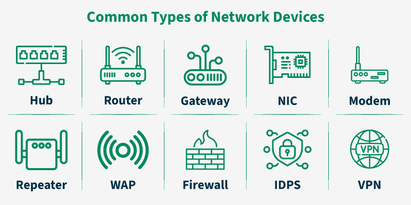

#### Functions of Network Devices
- Network devices help to send and receive data between different devices.
- Network devices allow devices to connect to the network efficiently and securely.
- Network devices improves network speed and manage data flow better.
- It protects the network by controlling access and preventing threats.
Expand the network range and solve signal problems.

#### Common Types of Networking Devices and Their Uses
Network devices work as a mediator between two devices for transmission of data, and thus play a very important role in the functioning of a computer network. Below are some common network devices used in modern networks:

- Access Point
- Modems
- Repeater
- Switch
- Routers
- Brouter
- NIC

#### Access Point
An access point in networking is a device that allows wireless devices, like smartphones and laptops, to connect to a wired network. It creates a Wi-Fi network that lets wireless devices communicate with the internet or other devices on the network. Access points are used to extend the range of a network or provide Wi-Fi in areas that do not have it. They are commonly found in homes, offices, and public places to provide wireless internet access.
#### Modems
Modem is also known as modulator/demodulator is a network device that is used to convert digital signal into analog signals of different frequencies and transmits these signals to a modem at the receiving location. These converted signals can be transmitted over the cable systems, telephone lines, and other communication mediums. A modem is also used to convert an analog signal back into digital signal. Modems are generally used to access the internet by customers of an Internet Service Provider (ISP).

Types of Modems
There are four main types of modems:

DSL Modem: Uses regular phone lines to connect to the internet but it is slower compared to other types.
- Cable Modem: Sends data through TV cables, providing faster internet than DSL.
- Wireless Modem: Connects devices to the internet using Wi-Fi relying on nearby Wi-Fi signals.
- Cellular Modem: Connects to the internet using mobile data from a cellular network not Wi-Fi or fixed cables.
#### Repeater
A repeater operates at the physical layer. Its main function is to amplify (i.e., regenerate) the signal over the same network before the signal becomes too weak or corrupted to extend the length to which the signal can be transmitted over the same network. When the signal becomes weak, they copy it bit by bit and regenerate it at its star topology connectors connecting following the original strength. It is a 2-port device.
#### Switch
A switch is a multiport bridge with a buffer designed that can boost its efficiency(a large number of ports imply less traffic) and performance. A switch is a data link layer device. The switch can perform error checking before forwarding data, which makes it very efficient as it does not forward packets that have errors and forward good packets selectively to the correct port only.  In other words, the switch divides the collision domain of hosts, but the broadcast domain remains the same.

##### Types of  Switch
- Unmanaged Switches: These switches have a simple plug-and-play design and do not offer advanced configuration options. They are suitable for small networks or for use as an expansion to a larger network.
- Managed Switches: These switches offer advanced configuration options such as VLANs, QoS, and link aggregation. They are suitable for larger, more complex networks and allow for centralized management.
- Smart Switches: These switches have features similar to managed switches but are typically easier to set up and manage. They are suitable for small- to medium-sized networks.
- Layer 2 Switches: These switches operate at the Data Link layer of the OSI model and are responsible for forwarding data between devices on the same network segment.
- Layer 3 switches: These switches operate at the Network layer of the OSI model and can route data between different network segments. They are more advanced than Layer 2 switches and are often used in larger, more complex networks.
- PoE Switches: These switches have Power over Ethernet capabilities, which allows them to supply power to network devices over the same cable that carries data.
- Gigabit switches: These switches support Gigabit Ethernet speeds, which are faster than traditional Ethernet speeds.
- Rack-Mounted Switches: These switches are designed to be mounted in a server rack and are suitable for use in data centers or other large networks.
- Desktop Switches: These switches are designed for use on a desktop or in a small office environment and are typically smaller in size than rack-mounted switches.
- Modular Switches: These switches have modular design that allows for easy expansion or customization. They are suitable for large networks and data centers.

#### Router
A router is a device like a switch that routes data packets based on their IP addresses. The router is mainly a Network Layer device. Routers normally connect LANs and WANs and have a dynamically updating routing table based on which they make decisions on routing the data packets. The router divides the broadcast domains of hosts connected through it.

#### NIC
NIC or network interface card is a network adapter that is used to connect the computer to the network. It is installed in the computer to establish a LAN.  It has a unique ID that is written on the chip, and it has a connector to connect the cable to it. The cable acts as an interface between the computer and the router or modem. NIC is a layer 2 device which means that it works on both the physical and data link layers of the network model.

## How Data Travels Through the Internet

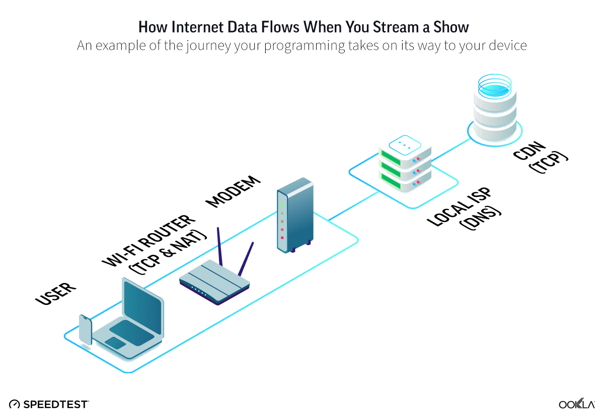

#### Step 1: Data Origination
The journey of data through the internet begins at the source, where it is created or transmitted. This could be a computer, smartphone, or any other device that can send data over the internet. When you type an email, upload a file, or send a message, the data is generated at this end.

#### Step 2: Network Interface
Once the data is generated, it reaches the network interface of the sending device. This could be an Ethernet port, Wi-Fi antenna, or any other device that enables communication over the internet. The network interface converts the digital data into analog signals, which can travel through the physical medium (cable) to reach the next device.

#### Step 3: Routing:
The data now travels through a network of routers and switches, which direct it towards its destination. These devices use complex algorithms to determine the shortest path for data to reach its final destination. The data may pass through multiple routers and switches before it reaches its final destination. Each device in the network has a unique address, known as an IP (Internet Protocol) address, which helps identify the data’s destination.

#### Step 4: Transit Network:
After the data leaves the last router on its path, it enters the transit network. This is the internet backbone, where high-speed connections between major networks and countries exist. The transit network is responsible for carrying a significant portion of the world’s internet traffic, and it uses specialized hardware and software to ensure efficient data transmission.

#### Step 5: Internet Exchange (IX):
The next stop for the data is an internet exchange (IX), which is a physical location where multiple networks meet. At the IX, the data is exchanged between different networks, ensuring that it reaches its final destination quickly and efficiently.

#### Step 6: Last Mile Connection:
Finally, the data reaches the last mile connection, which is the final leg of the journey to the recipient’s device. This could be a home network, office network, or any other local area network (LAN). The data is transmitted over a short distance using a high-speed connection, such as fiber optic cables or DSL lines.

#### Step 7: Reception and Processing:
Once the data reaches the recipient’s device, it is received and processed by the operating system and applications. The data is converted back into binary digits, which are then interpreted by the recipient’s device to display the content or execute the instructions.

#### Conclusion:
In conclusion, data travels through the internet in a complex but well-organized manner. From the origination point to the final destination, the data passes through various devices and networks, each playing a crucial role in ensuring efficient transmission. Understanding how data travels through the internet can help you appreciate the technology behind it and the effort that goes into making it possible for us to communicate, work, and access information across the globe.
