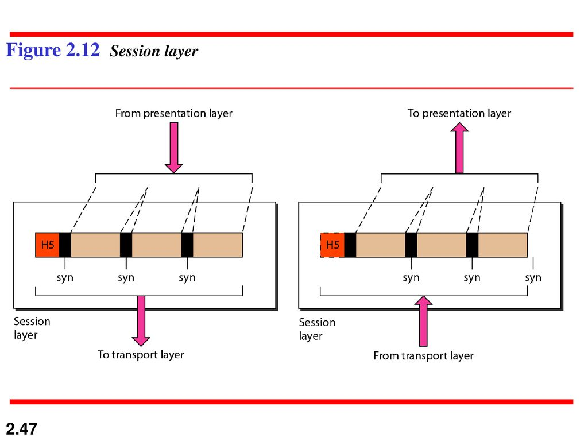

---

## 📌 **Table of Contents**  
1. [OSI Model](#-the-osi-model)  
2. [TCP vs UDP](#-tcp-vs-udp-key-differences)  
3. [IP Addresses & Subnet Masks](#-ip-addresses--subnet-masks)  
4. [Network Devices](#-network-devices-explained)  
5. [How Data Travels](#-how-data-travels-across-networks)  

---

## 🧩 **The OSI Model**  

The OSI (Open Systems Interconnection) model is a conceptual framework that standardizes the functions of a telecommunication or networking system, dividing it into seven layers. This model helps in understanding how different network components interact to enable communication between devices, regardless of their underlying technology. created by ISO (International Organization for Standardization), think about layers like a steps to communicat between devices.
This steps or layers is 7, and this steps happend is the two devices, the sender and the reciever do this steps in reverce,
if the sender goes from 7 to 1, reciever goes from 1 to 7.

this is how the data transform in each layer :

##### At sender:
⚫at each layer, a header can added to the data unit.
•At layer 2 a trailer is added as well.
•When formatted data unit passes through physical layer it is changed into an electromagnetic signal and transported along physical link.
##### Encapsulation:
A packet (header and data) at level 5 is encapsulated in a packet in level 4, and so on.
The data portion of packet at level N-1 carries the whole packet (data and header/trailer) from level N.
##### At destination:
⚫A data then move back up through the layer
⚫a headers and trailers attached to data at the corresponding layer are removed (decapsulated) and action appropriate to that layer are taken. (unwrapped/decapsulated)
At layer 5 the message is again in form appropriate to the application and is made available to user.

---
### OSI Layers
##### 1. Physical layer

The physical layer is responsible for movements of individual bits from one hop (node) to the next.

##### Physical characteristic of interfaces and media:
It defines the characteristic of the interface between devices and media. It also define the type of transmission media
##### Representation of bits:
The bit stream must be encoded into signals. It defines the type of representation ( how 0, 1 are changed to signal).
##### Data rate:
It defines the number of bits sent per second and also the duration of bits.
##### Synchronization of bits
The sender and receiver must be use the same bit rate also the receiver clock must be synchronized

##### Line configuration
Physical layer is concerned with the connection of devices to the media (point-to point or multipoint)
##### Physical topology:
• How devices connected to make a network
Devices can connected by using Star, mesh, bus, ring or hybrid topology
##### Transmission mode:
• It defines the direction of transmission between two devices (simplex, half-duplex, or full duplex)

#### 2. Data Link Layer(hop to hop delivery)

The data link layer is responsible for moving frames from one hop (node) to the next.

##### Framing:
Divide the stream of bits received from network layer into data units called frames
##### Physical addressing:
• It adds a header to the frame to define the sender and receiver of the frame.
If the frame for a system outside the sender's network the receiver address: is the address of the connecting device that connects the network to next one (Router/switch).
##### Flow control:
It imposes a flow control mechanism, if the data rate at the receiver is less than produced by sender the data link layer imposes a flow control to avoid overwhelming the receiver

##### Error control:
• Add mechanisms to detect and retransmit damaged or lost frames.
• Prevent also duplication of frames.
• Error control is normally achieved through a trailer added to the end of frame.
##### Access control:
• When two or more devices than one devices are connected to the same link, data link layer protocols are necessary to
determine which device has control over the link at given time.

Known also as the MAC or link address

Is the address of a node as defined by its LAN or WAN
It is included in the frame used by data link layer (Header) Ethernet uses 6-bytes (48-bits) physical address that imprinted on the NIC

Example :
A node with physical address 10 sends a frame to a node with physical address 87. The two nodes are connected by a link. At the data link level this frame contains physical addresses in the header. These are the only addresses needed. The rest of the header contains other information needed at this level. The trailer usually contains extra bits needed for error detection

#### 3. Network Layer(hop to hop delivery)

- The network layer is responsible for the delivery of individual packets from the source host to the destination host across multiple network.
- If two system are connected to the same link (network), no need for this layer.

##### Logical addressing
• In contrast to physical addressing implemented by data link layer
handling the addressing problem locally. Net work layer adds unique identifier (IP or logical address) to the packet.
These unique identifier( as tel. no, each tel. has unique number) enable special devices called router to make sure the packet get to correct system.
##### Routing:
provide the routing mechanism for the router which route the packet to their final destination.
Routers: devices used when independent networks are connected to create an internetworking (network of networks)

- IP addresses are necessary for universal communications that are
independent of physical network.
- No two host address on the internet can have the same IP address
- IP addresses 32-bit address that uniquley define a host connected to the Internet
 
Logical address (IP) The physical addresses will change from hop to hop, but the logical addresses remain the same. 

- The following figure shows a part of an internet with two routers connecting three LANs. Each device (computer or router) has a pair of addresses (logical and physical) for each connection. In this case, each computer is connected to only one link and therefore has only one pair of addresses. Each router, however, is connected to three networks (only two are shown in the figure). So each router has three pairs of addresses, one for each connection.

##### 5. Session Layer

The session layer is responsible for dialog control and synchronization.

1. Dialog control:
Allows two systems to enter into dialog. It allows communication between two processes in either half or full duplex.
2. Synchronization (Recovery)
Allow a process to add check points (Synchronization point) into a stream of data. So that if a failure of some sort occurs between checkpoints, the layer can retransmit all data since the last checkpoint.

##### 6. Presentation Layer

The presentation layer is responsible for translation, compression, and encryption.

- 1. Translation
At the sender it changes the information from its sender –
dependent format into common format. At receiving, changes the common format into its receiver-dependent format
- 2. Encryption-Decryption
To ensure privacy and security
- 3. Compression
Data compression reduces the number of bits contained in the information. It is important in the transmission of multimedia such as audio or video

##### 7. Application Layer

The application layer is responsible for providing services to the user.

The application layer is responsible for providing services to the user such as
Mail services
File transfer and access
Remote log-in Accessing the web (WWW)
- Telnet: A service that enables users on the internet to log onto remote systems from their own host system.
- HTTP: Hyper text transfer protocol used for network file transfers in WWW environment
- SMTP: Simple mail transfer protocol used to send electronic mail on the internet.

---

